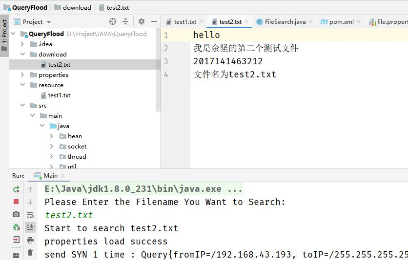

余坚 2017141463212

# 项目要求

基于请求流的文件分享

1. 使用socket进行编程
2. 每一个peer能够分享一个指定文件夹或者这个文件夹的子文件夹中的文件
3. 每一个peer能够通过请求流的方法搜索自己需要的资源
4. 每一个peer从第一个响应的peer那里通过C/S的模式下载该文件

# 解题思路

因为没有公网IP，做不了NAT穿透，所以实现局域网下的分享

1. 每一个peer指定一个文件夹作为分享文件夹，每接收到一个文件请求就在这个文件夹中进行文件搜索
2. 每一个peer指定一个下载文件夹，作为接收文件的目录
3. peer同时执行三个功能：通过UDP发送请求，接受UDP请求检索文件，通过TCP发送文件
4. peer在输入需要的文件名，程序将其封装为特定的报文格式通过UDP进行广播，等待响应报文或直到超时
5. 如果有peer有该文件，则发送响应报文给那个peer
6. peer收到响应报文后，创建TCP服务端，将该TCP的信息通过UDP发送给目标peer
7. 目标peer通过连接这个TCP将文件发送给源peer

# 开发环境和工具

Window 10

JDK 1.8

IDE：Jetbrans IDEA 

# 代码细节解释

这里只解释一些要点，很多细节在代码中实现，这里不再赘述

## bean 实体类

### Query

用来封装需要发送的报文内容，本项目所有的报文都解释成JSON格式进行发送和解析

```java
private InetAddress fromIP; //源IP地址
private InetAddress toIP;	//目标IP地址
private int fromPort;		//源端口
private int toPort;			//目标端口
private String filename;	//文件名
```

### Property

单例模式

加载配置文件并保存在内存中

## socket 发送与接收

### UDPSender

发送UDP报文的类

需要发送到目标主机地址和端口都保存在query对象中

query：需要发送的报文，直接编码成JSON文件格式，转换成二进制流进行发送

times：一段报文连续发送的次数，让UDP能够尽可能正确发送

```java
public class UDPSender {
    public void send(Query query, int times) {
        String content = new Gson().toJson(query);
        DatagramSocket datagramSocket = new DatagramSocket();
        for (int i = 0; i < times; i++) {
        	DatagramPacket packet = new DatagramPacket(content.getBytes(), 		content.getBytes().length, query.getToIP(), query.getToPort());
            datagramSocket.send(packet);
        }
    }
}
```

### UDPReceiver

接收UDP信息的类

UDP需要监听的端口号保存在query对象中（query.getToPort()）

query：接收报文信息的对象，能够将报文从子线程传递至主线程

timeout：一个UDP报文的监听时间长度，超过就自动断开监听

```java
public class UDPReceiver {
    public void receive(Query query, int timeout) {
        DatagramSocket datagramSocket = null;
        datagramSocket = new DatagramSocket(query.getToPort());
        datagramSocket.setSoTimeout(timeout);
        byte[] bytes = new byte[4096];
        DatagramPacket datagramPacket = new DatagramPacket(bytes, bytes.length);
        datagramSocket.receive(datagramPacket);
        query.update(new Gson().fromJson(new String(bytes, 0, datagramPacket.getLength()), Query.class));
    }
}
```

### TCPSender

通过TCP发送报文的类

通过query对象中的属性建立TCPSocket

往这个socket中发送整个文件的二进制流

```java
public class TCPSender {
    public void send(Query query) {
        Socket socket = new Socket(query.getFromIP(), query.getFromPort());
        OutputStream outputStream = socket.getOutputStream();
        LocalFile localFile = new LocalFile(query.getFilename());
        outputStream.write(localFile.getBytes(), 0, localFile.getBytes().length);
    }
}
```

### TCPReceiver

通过TCP接收文件的类

构造方法，创建一个可用的TCP服务端socket

0：表示随机使用一个可用的端口

1：最多有一个能够连接的客户端，防止恶意连接

IpAddr.getLocalIpAddr()：本机IP地址

```java
public TCPReceiver() {
    this.serverSocket = new ServerSocket(0, 1, IpAddr.getLocalIpAddr());
}
```

接收文件方法

首先设置超时时间，如果超时没有客户端进行连接就关闭服务器

在下载文件夹下创建文件然后将二进制流写入文件夹中

要使用while循环一直读取直到客户端关闭，否则可能会出现服务器提早关闭的情况

```java
public boolean receive(Query query, int timeout) {
    this.serverSocket.setSoTimeout(timeout);
    Socket socket = this.serverSocket.accept();
    File file = new File(Property.getProperty("download_dir") + query.getFilename());
    InputStream inputStream = socket.getInputStream();
    FileOutputStream outputStream = new FileOutputStream(file);
    byte[] bytes = new byte[1024];
    int l = 0;
    while ((l = inputStream.read(bytes)) != -1) {
        outputStream.write(bytes, 0, l);
    }
    return true;
}
```

## util 工具类

### Config

一些公用的静态属性

```java
public class Config {
    public static int SEARCH_FILE_SYN_PORT = 9000;			//接收文件搜索的端口
    public static int SEARCH_FILE_ACK_PORT = 9001;			//接收确认文件的端口
    public static int TCP_CONNECT_PORT = 9002;				//接收TCP服务器端信息的端口
    public static String BROADCAST_IP = "255.255.255.255";	//广播地址
}
```

### IpAddr

遍历所有网卡

简单起见，获取第一个端口的IP地址作为本地IP

### LocalFile

操作分享文件中文件的类

遍历整个分享文件夹，找到需要的文件就返回这个文件对象，没有找到就返回null

```java
private File searchDir(String filename) {
    //实现
}
```

判断文件是否存在

```java
public boolean isExist() {
}
```

返回文件的二进制流

```java
public byte[] getBytes() {
}
```

## thread 工作线程

###  SYNReceiver

用来接收外部的文件请求线程

首先是一直等待外界的文件请求UDP报文，没有超时时间

接收到一个报文之后，查询分享文件夹中是否存在该文件

如果存在该文件，就编写一个确认有文件的报文，往刚才的主机的Config.SEARCH_FILE_ACK_PORT端口发送该报文，表示我这里有这个文件

报文连续发送3次

如果没有文件就不做任何操作

```java
public class SYNReceiver implements Runnable {
    public void run() {
        while (flag) {
            Query synQuery = new Query();
            synQuery.setToPort(Config.SEARCH_FILE_SYN_PORT);
            new UDPReceiver().receive(synQuery, 0);

            if (new LocalFile(synQuery.getFilename()).isExist()) {
                Query sendQuery = new Query();
                //填写sendQuery详细信息…………
                new UDPSender().send(sendQuery, 3);
            }
        }
    }
}
```

### TCPConnect

接收外界的TCP服务器创建完成的消息

用UDP监听Config.TCP_CONNECT_PORT端口

接收到消息就表示对方主机已经建立了TCP服务器，可以进行文件传输

然后就创建TCP客户端直接发送文件

```java
public class TCPConnect implements Runnable {
    public void run() {
        while (flag) {
            Query tcpQuery = new Query();
            tcpQuery.setToPort(Config.TCP_CONNECT_PORT);
            new UDPReceiver().receive(tcpQuery, 0);
            new TCPSender().send(tcpQuery);
        }
    }
}
```

### FileSearch

搜索文件线程

首先读取用户的输入，就是要搜索的文件名

```java
Scanner scanner = new Scanner(System.in);
String filename = scanner.next();
```

发送文件搜索请求和接受确认文件存在的过程

search_times：一个文件的搜索次数，到达该次数之后就表示文件在子网中不存在，不再重复请求

每一个UDPReceiver代表一次完整的搜索等待过程

```java
//SYN 请求体 填写对应内容…………
Query synQuery = new Query();
//ACK 接收体 填写对应内容…………
Query ackQuery = new Query();

int search_times = Integer.parseInt(Property.getProperty("search_times"));
for (int i = 0; i < search_times; i++) {
    new UDPSender().send(synQuery, 3);
    new UDPReceiver().receive(ackQuery,
                              Integer.parseInt(Property.getProperty("udp_timeout")));
    if (ackQuery.getFilename() != null && ackQuery.getFilename().equals(filename)) {
        //表示接收到了正确的ACK
        break;
    }
}
```

在接收到ACK之后就创建一个TCP服务器

然后项目标主机发送TCP可以连接的报文

如果正确接收到一份文件就退出循环

```java
// 创建接收文件的TCP服务器
TCPReceiver tcpReceiver = new TCPReceiver();

// TCP连接请求体 填写对应内容…………
Query tcpQuery = new Query();

int tcp_connect_times = Integer.parseInt(Property.getProperty("tcp_connect_times"));
for (int i = 0; i < tcp_connect_times; i++) {
    new UDPSender().send(tcpQuery, 3);
    boolean isSuccess = tcpReceiver.receive(tcpQuery,Integer.parseInt(Property.getProperty("tcp_timeout")));
    if (isSuccess) {
        break;
    }
}
```

# 项目使用演示

## 运行方式

本项目是Java的Maven项目，使用到了Gson包

所以先使用IDEA打开本项目，然后等待内置maven下载完jar包后就可以运行Main.java的main函数来运行项目

每一个main的运行都可以认为是一个peer


##  测试网络环境

项目的运行测试是在手机热点局域网下进行的

两台Windows 10系统PC机

IP地址如下图所示


## 操作过程

两台PC同时运行main函数加入到请求洪泛中

初始条件下，PC1的分享文件夹下有一个test1.txt文件，而download文件夹下是空的


PC2的分享文件夹下有一个test2.txt文件，download文件夹也是空的


PC1在命令行中输入test2.txt，按回车后就发送洪泛开始搜索该文件

这个时候因为是广播地址广播，所以自己也会收到，但是自己没有test2.txt，所以没有理会

因为PC2有这个文件，所以发送确认ack，然后通过tcp将文件发送给了PC1


在PC1个download文件夹下出现了test2.txt文件



同样的操作，PC2请求test1.txt文件

能够正确接收


PC1在洪泛中查询不存在的test3.txt文件

因为这个子网中没有test3.txt文件，所以在重复的几次超时之后，peer认定这个文件不存在，不再进行查询

